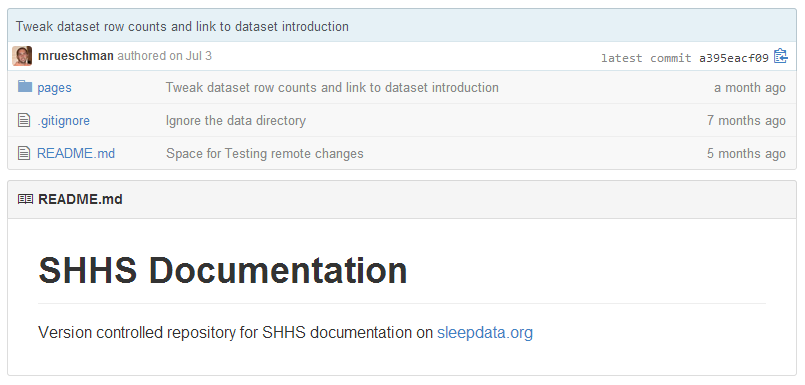
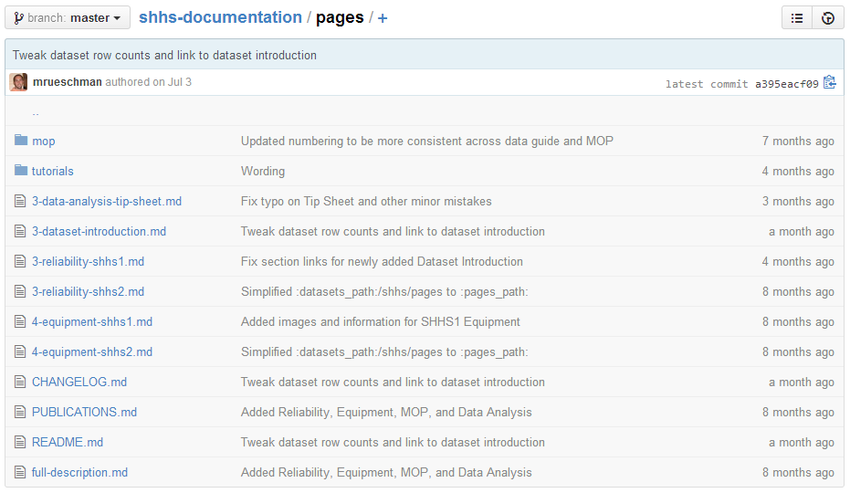

# Structure Your Documentation

Within the documentation repository, you should first create a `pages` folder, which will serve as the root level for documentation shared through sleepdata.org.

The first page of documentation displayed to visitors of sleepdata.org will be the `README.md` file created within the `pages` folder. **Important:** This will be different from the `README.md` file that was created when you initialized your repository.

After creating your first page of documentation, other documents can be added within the `pages` folder. Here is an example documentation repository:

Depending on the set of compiled documentation, additional folders can be created within `pages` to more smartly arrange your files.

### _Next: [Convert to Markdown](convert_to_markdown.md)_
