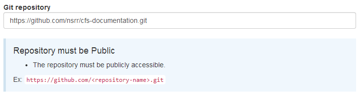
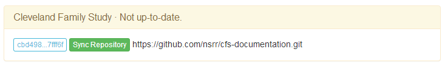

# Sync Your Documentation

The final step in taking what you have posted in your GitHub repository and making it available on sleepdata.org is to complete the syncing process.

Initially, you must edit the settings for the dataset you have created on sleepdata.org and set the "Git repository" URL. Here is an example:

The sleepdata.org server will pull the documentation pages you have posted over and display them on your dataset's main page.

When you make updates to your documentation and push them to your GitHub repository, there will be an additional step required to sync these changes to sleepdata.org. To do this, you must visit this specific URL:

    sleepdata.org/datasets/<your-dataset>/sync

sleepdata.org will inform you whether its copy of your documentation is in or out of sync with what is on GitHub.

Clicking "Sync Repository" will make sleepdata.org and GitHub match.

**Recommendation:** After syncing any documentation changes, review these changes and confirm everything is working as anticipated with your dataset's documentation on sleepdata.org.

### _Next: [Common Items to Include](common_items_to_include.md)_
