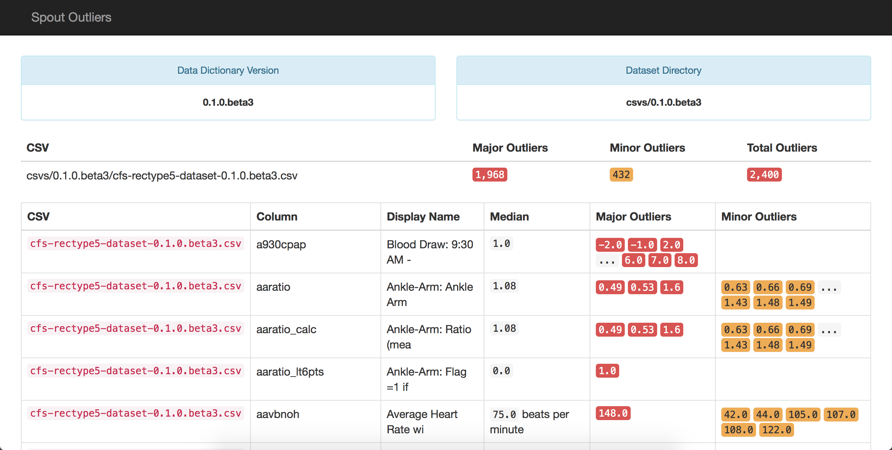
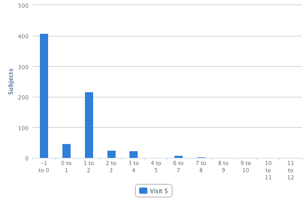

# Check for Implausible Values

Once the data dictionary reaches 100% coverage with the versioned dataset, users can use a variety of different Spout tools to check the actual contents of the data to ensure the reported values make sense. The different methods are described below:

## Spout Outlier Check

Spout has functionality built-in to check datasets for major and minor outliers, using standard inner and outer fence formulas, which can be invoked by using `spout o`. More documentation on how Spout calculates fences and outliers can be found [here](http://www.wikihow.com/Calculate-Outliers).

This is a sample outlier report generated by Spout:

In the report, Spout shows variables for which there are major or minor outliers present in the dataset. It's similar in many aspects to the coverage report that was previously shown; it prominently shows the dataset and data dictionary versions that were used to check for outliers.

Additionally, Spout pulls in units from variables, where present, to give more context about the median that is being displayed.

Using this outlier check, someone who is familiar with the project can begin to parse through the variables for which outliers are present and then determine if those values are plausible.

For example, in the picture above, the variable `aavbnoh` has one major outlier of 148 beats per minute during sleep, which is physiologically possible. However, if it were 4 beats per minute or 300 beats per minute, these would be obviously not physiologically possible and should be removed from the dataset.

Spout's outlier report also allows users to look for error codes or system missing codes that could have accidentally have been exported as real data. For example, in the Cleveland Family Study, `-1` was used as a standard missing code. In variables such as heart rate or blood pressure, a value of -1 would be marked as an outlier and can be removed from the dataset. That being said, the outlier report will invariably miss some of the system missing codes, such as -1, for variables that have small values.

For that reason, it is recommended that the outlier report be used in combination with Spout's graphical data display, which is explained below.

## Spout Images

In addition to generating coverage and outlier reports, Spout can also generate histograms of the data using the command `spout p`. These graphs eventually become the charts and tables that are presented on the variable pages of the NSRR website. An example graph is pictured below.

The graph above pictures a histogram that represents the distribution of data for the variable `acetamno`, which is the average number of tablets of acetaminophen consumed.

In the outlier report, the median response for this answer is currently -1 and thus was not flagged as an outlier. However, it is not possible for a patient to, on average, take a negative amount of medication per day. Because users are able to visually see the distribution of data, it's possible for this `-1` missing code to be discovered and removed from the dataset.

Using these two tools together, it is possible for someone with a basic knowledge of the study to go through and remove obviously incorrect values, such as missing codes. However, after the obvious errors have been corrected, someone with an expert knowledge of the specific data type (i.e. polysomnography or electrocardiology) will need to look through the subject-specific variables to identify impossible values that may not leap out to the lay person.
