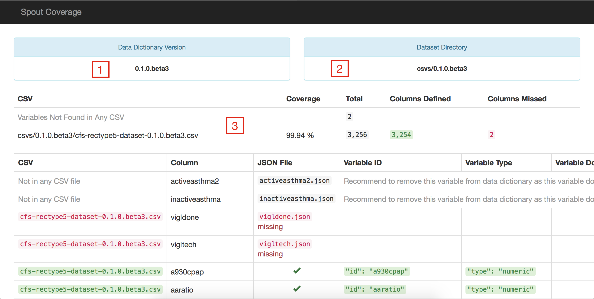

# Check Your Coverage

Spout Coverage is one of the first tools used to check the quality of data, once the datasets and data dictionaries have been assembled. It allows Spout to take the prepared datasets and compare them to the variables that are found in the data dictionary. The command to test the coverage of a dataset is `Spout C` in terminal or the command prompt, and gives an output similar to the one below.

```
informinion:example-data-dictionary michael$ spout c
Parsing: csvs/0.1.0/example-dataset-0.1.0.csv
.........................................................................

Using dataset in csvs/0.1.0/

Generating: index.html

/Users/michael/code/examples/example-data-dictionary/coverage/index.html
```

In order to function properly, Spout requires the user to have a local copy of the latest dataset to be saved within the repository in a 'csvs' folder.

Example: `/Users/michael/code/examples/example-data-dictionary/csvs/0.1.0/example-dataset-0.1.0.csv`

Spout will use the CSV dataset in this folder, and try to match it against variables in the data dictionary that are of the same version and generate a coverage report, similar to this one, which has been annotated to highlight the report's features:



Features:
  1. This is the data dictionary version, as specified in the `VERSION` file
  2. This is the dataset version, which is specified in the naming of the csvs subfolders
  3. These are the overall statistics for the data dictionary, it shows the following:
    - Coverage: Percentage of the variables in the dataset that are covered by the data dictionary
    - Total: Number of variables in the dataset
    - Columns Defined: Number of variables present in both the data dictionary and the dataset
    - Columns Missed: Number of variables found in the dataset but not in the data dictionary
    - The `Variables Not Found in Any CSV` represents the number of variables that are in the data dictionary and do not correspond to any variables in the dataset

The different columns in the report give more detailed information about each variable, such as the type, filename, variable ID, the domain (if applicable) and all of the values for `type: choices` variables. The report uses a similar highlighting color scheme to note where domain options do not properly cover the options in the dataset

Once the coverage report shows the data dictionary to be 100% matching with the dataset, someone who is familiar with the project can begin to look at the actual quality of data in the dataset.
