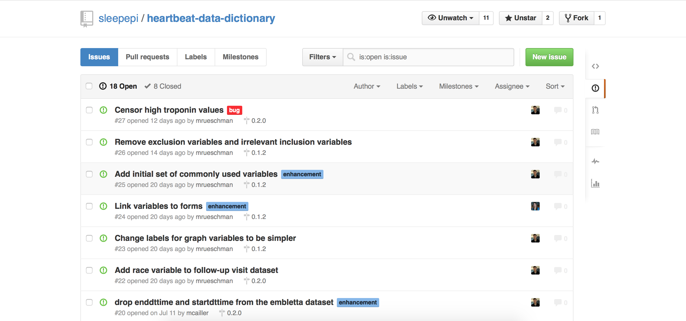
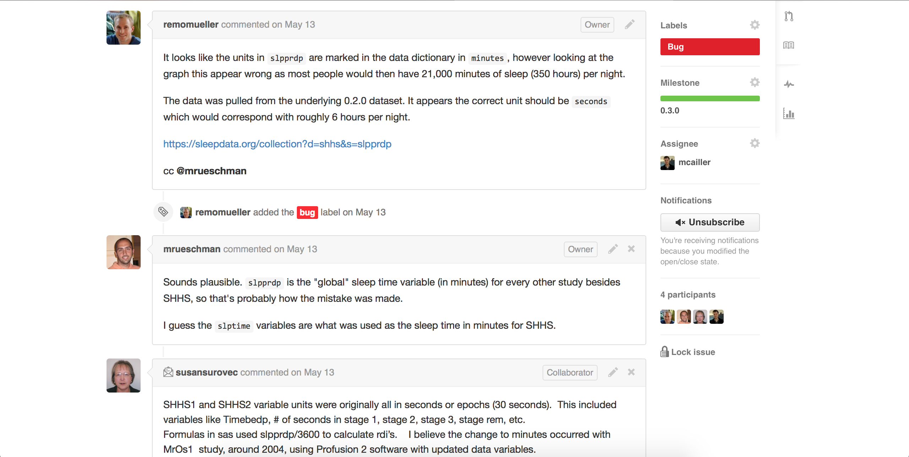

# Track Issues

As issues are identified with the data, it is important to gather feedback from individuals who are familiar with the project and to track how issues evolve. For this reason, the NSRR team have devised two different methods for tracking different kinds of issues.

## GitHub Issue Tracking

For data issues that can be easily resolved, members of the NSRR Informatics team utilize GitHub's [native issue tracking](https://help.github.com/articles/about-issues).

GitHub allows for issues to be created, assigned to specific users, labeled (e.g. as a `bug`, `enhancement`, or `new feature`), assigned to a specific version, and commented upon. Issues that are typically resolved in this manner ones such as the presence of missing codes in the dataset or impossible values. These issues are then typically resolved by editing datasets in SAS before they are exported to a CSV format.

The comments section of issues becomes particularly useful when an issue requires the input of people who actually worked on the project. In [this issue](https://github.com/sleepepi/shhs-data-dictionary/issues/67), it was only through the assistance of someone who was familiar with the reasoning behind variables having different units that the issue was able to be resolved.

## Known Issues List
